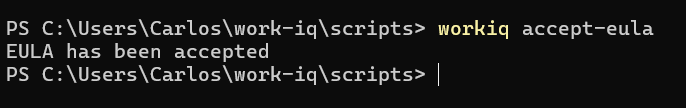
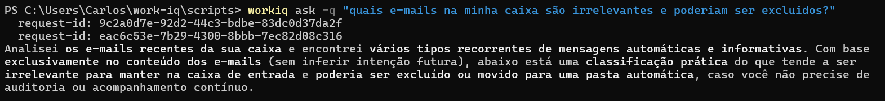
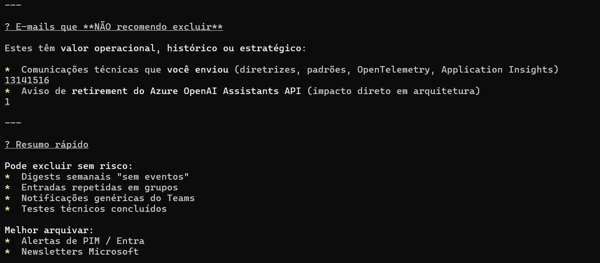

# Work IQ CLI — instalação e uso (read-only)

Instale o `@microsoft/workiq` para consultar seus dados do Microsoft 365 via linguagem natural diretamente no terminal.

> 🔒 Tudo aqui é **read-only** — `workiq ask` apenas consulta; nada é criado, alterado ou excluído.

---

## Pré-requisitos

- **Node.js ≥ 18** ([nodejs.org](https://nodejs.org/))
- Tenant já configurado pelo admin → ver [`../tenant-setup/`](../tenant-setup/)
- Licença **Microsoft 365 Copilot add-on** ativa para o usuário

---

## Opção 1 — Script automatizado (recomendado)

### macOS / Linux

```bash
./cli/setup-workiq-cli.sh
```

### Windows

```powershell
.\cli\setup-workiq-cli.ps1
```

O script:
1. Verifica se o Node.js está instalado.
2. Instala `@microsoft/workiq` globalmente via NPM.
3. Roda `workiq accept-eula` (obrigatório na primeira execução).
4. Mostra o snippet MCP a ser colocado em `.vscode/mcp.json` (ver [`../vscode-mcp/`](../vscode-mcp/)).
5. Detecta o GitHub Copilot CLI e mostra o comando de plugin.

---

## Opção 2 — NPM global manual

```bash
npm install -g @microsoft/workiq
workiq accept-eula
workiq ask -q "Quais reuniões tenho hoje?"
```

Após o `accept-eula`, você vê uma confirmação no terminal:



---

## Opção 3 — NPX sem instalar

```bash
npx -y @microsoft/workiq@latest ask -q "Resuma meus e-mails não lidos"
```

> Diferente do `npm` (que instala pacotes), o `npx` (Node Package Execute) baixa o pacote para um cache temporário, executa e descarta. Bom para experimentar sem poluir o sistema.

---

## Opção 4 — GitHub Copilot CLI (como plugin)

Use o Work IQ como plugin do **GitHub Copilot CLI**:

```bash
copilot                                    # abre o Copilot CLI
/plugin marketplace add microsoft/work-iq  # uma vez
/plugin install workiq@work-iq
/plugin install workiq-productivity@work-iq
workiq accept-eula
```

Depois disso, basta fazer perguntas em linguagem natural dentro do Copilot CLI:

```
Você: Quais são minhas reuniões de hoje?
Você: Resuma os e-mails não lidos da última hora
Você: Quem é meu gestor?
```

---

## Comandos disponíveis

| Comando | Descrição |
| --- | --- |
| `workiq accept-eula` | Aceita a EULA — obrigatório na primeira execução. |
| `workiq ask` | Modo interativo — chat no terminal. |
| `workiq ask -q "pergunta"` | Pergunta direta sem entrar em modo interativo. |
| `workiq ask -t "tenant-id" -q "..."` | Especifica o tenant manualmente. |
| `workiq mcp` | Inicia o servidor MCP (para clientes — não para humanos). |
| `workiq version` | Versão instalada. |

📖 Ver tabela completa de opções e mais exemplos em [`../docs/examples.md`](../docs/examples.md).

---

## Exemplos rápidos

```bash
workiq ask -q "Quais reuniões tenho hoje?"
workiq ask -q "Resuma os e-mails não lidos por prioridade"
workiq ask -q "Encontre documentos que trabalhei nos últimos 3 dias"
workiq ask -q "Quem é meu gestor?"
workiq ask -q "Resuma as mensagens de hoje no canal de Engenharia"
```

Exemplo real — perguntando quais e-mails são irrelevantes:





Catálogo completo: [`../docs/examples.md`](../docs/examples.md).

---

## Arquivos deste diretório

| Arquivo | Plataforma |
| --- | --- |
| [setup-workiq-cli.sh](./setup-workiq-cli.sh) | macOS / Linux (bash) |
| [setup-workiq-cli.ps1](./setup-workiq-cli.ps1) | Windows (PowerShell 7+) |

---

## Próximo passo

Quer usar o Work IQ direto no editor? Veja [`../vscode-mcp/`](../vscode-mcp/).
