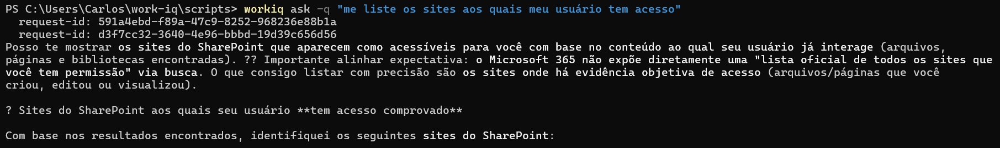

# Usage examples (read-only)

> Catalog of natural-language prompts for use with `workiq ask` in the terminal **or** with the `ask_work_iq` tool in any MCP client (VS Code Copilot Chat, Copilot Studio, Azure AI Foundry, Claude…).

All examples below are **read-only**: they query Microsoft 365 data through Microsoft Graph without changing any resource.

---

## 📅 Calendar and meetings

```bash
workiq ask -q "What meetings do I have today?"
workiq ask -q "What meetings do I have in the next 24 hours?"
workiq ask -q "Do I have any meeting this week with the sales team?"
workiq ask -q "What is the cost in hours of my recurring meetings this week?"
workiq ask -q "Who organized yesterday's 2pm meeting?"
```

## 📧 Emails

```bash
workiq ask -q "Summarize today's unread emails by priority"
workiq ask -q "Is there any email from project X waiting for my reply?"
workiq ask -q "Which emails in my inbox are irrelevant and could be archived?"
workiq ask -q "Are there urgent emails from Sarah about the budget?"
```

## 📄 Documents (SharePoint / OneDrive)

```bash
workiq ask -q "Find documents I worked on in the last 3 days"
workiq ask -q "What is the content of project Y's spec on SharePoint?"
workiq ask -q "Which SharePoint files are related to customer Contoso?"
workiq ask -q "List the sites my user has access to"
```



> 💡 Notice the response above: Work IQ **is not Microsoft Graph**. It lists sites based on **objective evidence of access** (files/pages you created, edited or viewed) — not on the exhaustive list of tenant permissions. This is by design of the intelligence layer.

## 👥 People and organization

```bash
workiq ask -q "Who is my manager?"
workiq ask -q "Who are my direct reports?"
workiq ask -q "Who is working on Project Alpha?"
workiq ask -q "What is Maria Silva's job title?"
workiq ask -q "How do I reach the infrastructure team?"
```

## 💬 Teams

```bash
workiq ask -q "Summarize today's messages in the Engineering channel"
workiq ask -q "Were there any important decisions in the squad chat yesterday?"
```

---

## Composite scenarios

### 1. Week Radar (executive briefing)

> Every Monday, generate a complete briefing of the week.

```bash
workiq ask -q "Build an executive briefing for my week: list scheduled meetings, top unread emails, documents modified in the last 3 days, and compute the total cost in hours of all meetings this week"
```

### 2. Smart onboarding for a new teammate

> Personalized onboarding guide generated from real tenant data.

```bash
workiq ask -q "I am new on the [TEAM] team. Based on emails, documents and Teams channels, tell me: who are the key people I should know, which projects are active, which documents I should read first, and what important decisions were made in the last 30 days"
```

### 3. Auditor of unnecessary meetings

> Identify recurring meetings that could become async updates.

```bash
workiq ask -q "Analyze my recurring meetings of the last 30 days. For each one: list participants, average duration, frequency, and whether decisions or actions were recorded. Compute the total cost in hours per person and identify which ones could be replaced by async updates"
```

### 4. Pull request description co-author (in VS Code)

> With MCP active in Copilot Chat, request context before opening the PR.

```
Search Work IQ for all emails, meetings and documents related to the
[NAME] feature. Using that context, generate a complete PR description
including: business context, technical decisions taken, who should
review, and the link to the spec on SharePoint.
```

### 5. Customer context for support

```
What were the latest emails, meetings and tickets related to customer
Contoso? Summarize the current relationship status.
```

---

## CLI options (`workiq ask`)

| Short | Long | Argument | Description |
| --- | --- | --- | --- |
| `-q` | `--question` | `<question>` | Natural-language question. |
| `-f` | `--file-urls` | `<file-urls>` | URLs of OneDrive/SharePoint files to force as root context. |
| `-t` | `--tenant` | `<tenant-id>` | Specific tenant (when you belong to more than one). |
| `-v` | `--verbose` | — | Verbose logs (`request-id`, `conversation ID`). |
| `-d` | `--developer` | — | Developer mode (raw JSON payloads). |
| `-?, -h` | `--help` | — | Help menu. |

---

## Troubleshooting

| Error | Cause | Solution |
| --- | --- | --- |
| `AADSTS650052` | Service Principal not provisioned | Run [`Enable-WorkIQToolsForTenant.ps1`](../tenant-setup/Enable-WorkIQToolsForTenant.ps1) |
| `Access Denied` | No Copilot license or no consent | Check the license at `admin.microsoft.com` and re-run admin consent |
| MCP not showing in Copilot Studio | Frontier not enabled | Enable via Admin Center → Services → Microsoft 365 Insider |
| Cursor "blinking" after `workiq mcp` | Expected — server waiting for a client | Not an error; configure it in the agent file (see [../vscode-mcp/](../vscode-mcp/)) |
