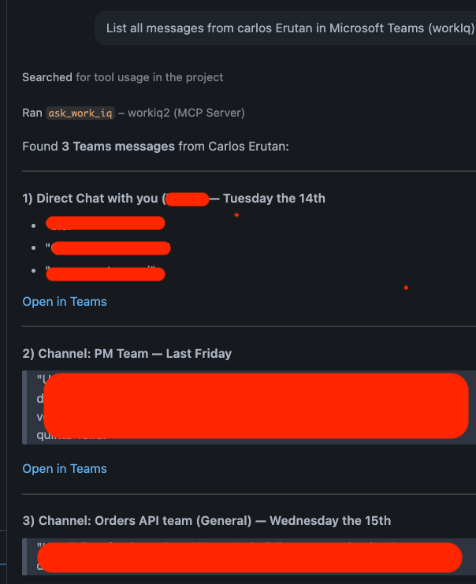

# Work IQ MCP in VS Code + GitHub Copilot (read-only)

Configure VS Code's **GitHub Copilot Chat** (or any other MCP client) to consume the **Work IQ MCP Server**, then layer a **custom GitHub Copilot agent** on top so the assistant always grounds its answers in your real Microsoft 365 data, emails, calendar, documents, Teams and organization, without ever changing anything.

---

## What you get

1. **MCP server (`workiq`)** registered in VS Code → Copilot Chat can call Work IQ tools.
2. **Custom agent (`Personal Assistant`)** living in `.github/agents/` → a focused persona, restricted to `workiq/*` tools, ready to be picked from the agent selector or invoked as a subagent.
3. **Prompt catalog** for day to day tasks (briefings, reviews, drafts, onboarding).

---

## Prerequisites

- Up-to-date **VS Code** with the **GitHub Copilot** and **GitHub Copilot Chat** extensions.
- **Node.js ≥ 18** installed (for `npx`).
- Tenant configured by the admin → [`../../tenant-setup/`](../../tenant-setup/).
- Active **Microsoft 365 Copilot add-on** license.
- (Optional) `workiq accept-eula` run once, see [`../../cli/`](../../cli/).

> You **do not need** to install `@microsoft/workiq` globally. The snippet below uses `npx`, which fetches the package on demand.

---

## Files in this directory

| File | Purpose |
| --- | --- |
| [mcp-config.json](./mcp-config.json) | Single, portable MCP snippet. Works in VS Code (`.vscode/mcp.json`) and any other MCP client. |
| [personal-assistant.agent.md](./personal-assistant.agent.md) | Example **GitHub Copilot custom agent** scoped to the Work IQ MCP. Copy to `.github/agents/`. |

---

## Step 1: register the MCP server

The file [`mcp-config.json`](./mcp-config.json) is the **single, portable** snippet that works in VS Code as well as in any other MCP client (Claude Desktop, Azure AI Foundry, Copilot Studio in advanced config, custom agents):

```json
{
  "mcpServers": {
    "workiq": {
      "command": "npx",
      "args": ["-y", "@microsoft/workiq@latest", "mcp"],
      "tools": ["*"]
    }
  }
}
```

VS Code reads MCP configuration from an `mcp.json` file. There are two options:

### Option A, workspace (recommended for teams)

Create `.vscode/mcp.json` at the root of your project and paste the contents of [`mcp-config.json`](./mcp-config.json). Commit it so every teammate gets the same configuration.

### Option B, user-wide

`Cmd/Ctrl + Shift + P` → **MCP: Open User Configuration** → paste the contents of [`mcp-config.json`](./mcp-config.json).

### Activate it in Copilot Chat

1. Restart VS Code.
2. In the Copilot Chat panel → 🔧 **Tools** icon → toggle **`workiq`** on.
3. The first call will request a Microsoft 365 sign-in consent.

---

## Step 2: custom GitHub Copilot agent (Optional)

GitHub Copilot in VS Code supports **custom agents** declared as `*.agent.md` files. They are personas with their own instructions, tool restrictions and (optionally) model preference. Storing them in `.github/agents/` makes them shareable through your repository.

### Folder layout

```
<your-repo>/
├── .github/
│   ├── agents/
│   │   └── personal-assistant.agent.md   ← copy of the example below
│   └── copilot-instructions.md           ← optional, repo-wide guidance
└── .vscode/
    └── mcp.json                          ← from Step 1
```

### Copy the example

```bash
mkdir -p .github/agents
cp work-iq/vscode-mcp/personal-assistant.agent.md .github/agents/
```

> Prefer a personal, cross-workspace agent? Drop the same file into your VS Code user profile under the agents folder (`MCP/Prompts: Open User Folder`). It will follow you through Settings Sync.

### Anatomy of [personal-assistant.agent.md](./personal-assistant.agent.md)

```yaml
---
description: "Personal productivity assistant grounded in Microsoft 365 data via Work IQ MCP. Use when: planning your day, summarizing emails or meetings, ..."
name: "Personal Assistant"
argument-hint: "What do you need from your Microsoft 365 data?"
---
```

Key choices:

| Field | Why this value |
| --- | --- |
| `tools: [workiq/*, ...]` | The agent can call **every** Work IQ MCP tool, plus light read/search/todo helpers. No `edit`, no `execute`, no `web`, on purpose. |
| `description` | Starts with **"Use when:"** so other agents (and the Copilot delegator) know exactly when to hand off. |
| `model` | Array form provides a fallback if the first model is not available in the user's plan. |
| Body | Defines the persona, hard constraints (read-only, no fabrication, cite sources) and an output format. |

### Activate it

1. Restart VS Code (or reload the window).
2. In Copilot Chat, open the **agent picker** (top of the chat input).
3. Select **Personal Assistant**. The chat header now shows the agent name and the `workiq` tool badge.

---

## Step 3: use it

Once the agent is active, just ask in natural language. The assistant will call `workiq/*` under the hood and ground every answer in your tenant data.

### Example

```
List all messages from Carlos Erutan in Microsoft Teams (Work IQ).
```



More prompt ideas: [`../../docs/examples.md`](../../docs/examples.md).

---

## Combining the custom agent with other Copilot features

| You want to… | Pattern |
| --- | --- |
| Reuse the agent inside another agent | Add `Personal Assistant` to the parent agent's `agents:` list and reference it by description from the body. |
| Trigger it as a slash command | Wrap a recurring prompt in `.github/prompts/<name>.prompt.md` and have the prompt call the agent. |
| Constrain it further (e.g. only calendar tools) | Replace `workiq/*` with the explicit Work IQ tool names you want exposed. |
| Use it from the CLI | The same MCP snippet works with **GitHub Copilot CLI** and the **Work IQ CLI**, see [`../../cli/`](../../cli/). |

---

## Other MCP clients

The same [`mcp-config.json`](./mcp-config.json) works in any client that reads the standard MCP format. Examples:

| Client | Where to paste |
| --- | --- |
| **Claude Desktop** | `claude_desktop_config.json` |
| **Azure AI Foundry** | Agent configuration → Tools → MCP |
| **Copilot Studio** | Tools → Add MCP server (advanced config) |
| **GitHub Copilot CLI** | `~/.config/github-copilot/mcp.json` |
| **Custom agent** | Whatever file your MCP client expects |

---

## Troubleshooting

| Symptom | Likely cause | Action |
| --- | --- | --- |
| `workiq` does not show under Tools | `mcp.json` not saved / VS Code not restarted | Save the file and restart VS Code. |
| `Personal Assistant` does not show in the agent picker | File is not under `.github/agents/`, or YAML frontmatter is broken (unquoted colons, tabs) | Move the file, validate the frontmatter, reload the window. |
| `Access Denied` on the first call | No Copilot license or consent not granted | See [`../../tenant-setup/`](../../tenant-setup/). |
| `command not found: npx` | Node.js not installed | Install Node.js ≥ 18. |
| Agent answers from "general knowledge" instead of `workiq` | Tool was not toggled on, or the agent's `tools:` list does not include `workiq/*` | Check the tool badge in the chat header and the agent frontmatter. |
| Empty answers or "I don't have access" | The signed-in user really lacks Graph permission for the resource | Expected, Work IQ inherits delegated permissions. |
