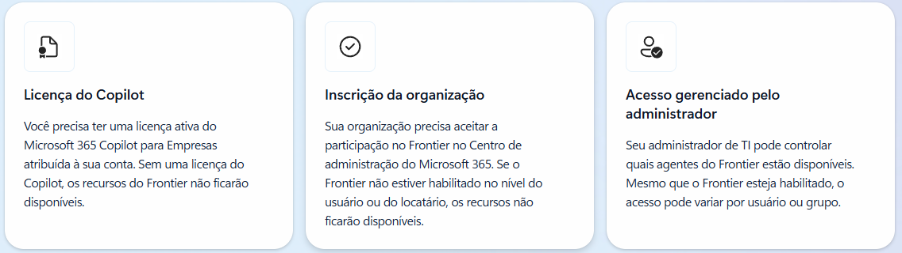
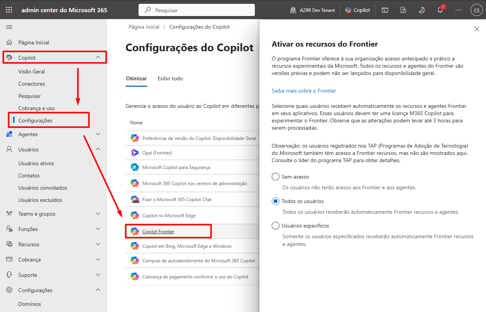
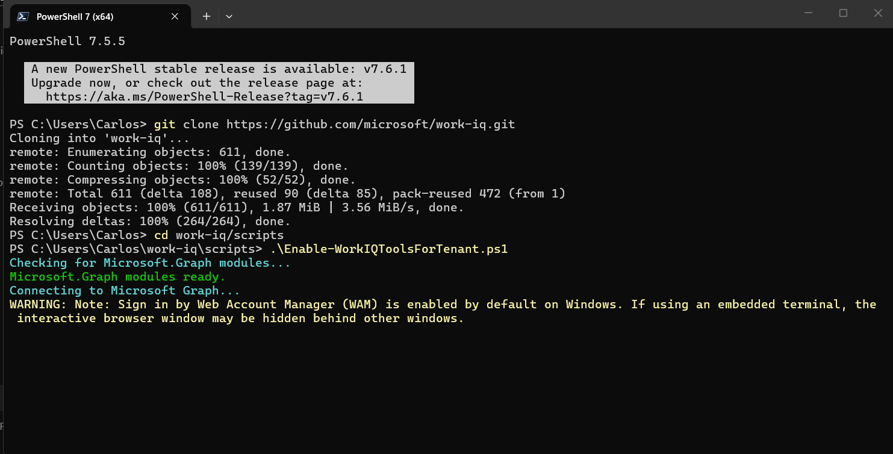
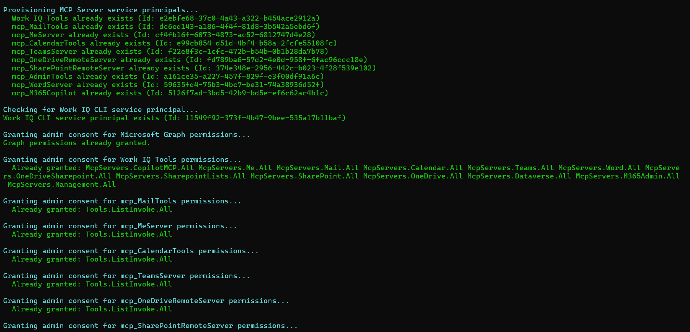
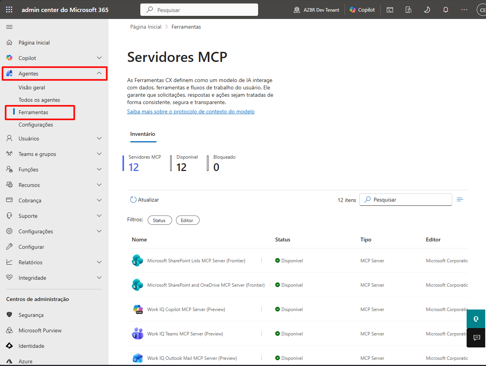

# Tenant Setup — Admin M365

Passos executados pelo **Administrador do tenant** (Global Admin, Cloud Application Admin ou Application Admin) para habilitar o Work IQ no Microsoft 365.

> 📖 Antes de começar, leia [`docs/overview.md`](../docs/overview.md) para entender pré-requisitos e o modelo de permissões.

---

## Visão geral do fluxo

```
1. Verificar licenças Copilot add-on
        │
        ▼
2. Habilitar Programa Frontier
        │
        ▼
3. Provisionar Service Principals + Admin Consent
   (script PowerShell)
        │
        ▼
4. Verificar configuração
        │
        ▼
5. Gerenciar MCP Servers no Admin Center
```

---

## 1. Verificar licenças

Acesse `admin.microsoft.com → Faturamento → Licenças` e confirme que os usuários têm a licença **Microsoft 365 Copilot add-on** atribuída.

> ⏱️ Após atribuir, aguarde até **24h** para propagação completa.

---

## 2. Habilitar o Programa Frontier

O Frontier exige três condições simultâneas: licença Copilot, inscrição da organização e liberação pelo admin.



1. Acesse [admin.microsoft.com](https://admin.microsoft.com).
2. Navegue até **Configurações → Configurações da Organização → Serviços**.
3. Procure por **"Microsoft 365 Insider"** / **"Frontier"**.
4. Ative para os usuários ou grupos desejados.



> 💡 Sem o Frontier, os MCP Servers do Work IQ **não aparecem** no catálogo do Copilot Studio nem no Azure AI Foundry.

Mais detalhes: [Microsoft Frontier Program](https://www.microsoft.com/pt-br/microsoft-365-copilot/frontier-program).

---

## 3. Provisionar Service Principals + Admin Consent

### Opção A — Script PowerShell (recomendado)

```powershell
# Pré-requisito: PowerShell 7+ e módulo Microsoft.Graph
Install-Module Microsoft.Graph -Scope CurrentUser

cd tenant-setup
.\Enable-WorkIQToolsForTenant.ps1
```



O script provisiona automaticamente os Service Principals: **Work IQ Tools, Mail, Calendar, Teams, OneDrive, SharePoint, Word, Admin, Me e M365 Copilot** e concede admin consent para as permissões necessárias.



### Opção B — URL de consentimento rápido (1 clique)

```
https://login.microsoftonline.com/SEU_TENANT_ID/adminconsent?client_id=e1ef8955-6b2c-4f30-9e71-8ede31ae55ee
```

> ⚠️ Se retornar `AADSTS650052`, o Service Principal ainda não foi provisionado — use a **Opção A**.

---

## 4. Verificar configuração

Script somente leitura — seguro de rodar em produção:

```powershell
.\Verify-WorkIQSetup.ps1
```

Saída esperada: ✅ para cada Service Principal do Work IQ.

---

## 5. Gerenciar MCP Servers no Admin Center

1. Acesse `admin.microsoft.com → Agentes e Ferramentas`.
2. Visualize todos os MCP Servers ativos.
3. Use **Permitir** / **Bloquear** por política organizacional.



Para auditar chamadas MCP em tempo real, use **Microsoft Defender → Advanced Hunting**.

---

## Arquivos deste diretório

| Arquivo | Descrição |
| --- | --- |
| [Enable-WorkIQToolsForTenant.ps1](./Enable-WorkIQToolsForTenant.ps1) | Provisiona Service Principals e concede admin consent. |
| [Verify-WorkIQSetup.ps1](./Verify-WorkIQSetup.ps1) | Diagnóstico somente leitura do tenant. |

---

## Próximos passos

- Admin pronto → entregue o tenant configurado para os devs/usuários.
- Usuário/Dev → [`../cli/`](../cli/) para instalar o Work IQ CLI.
- Editor → [`../vscode-mcp/`](../vscode-mcp/) para configurar no VS Code.
